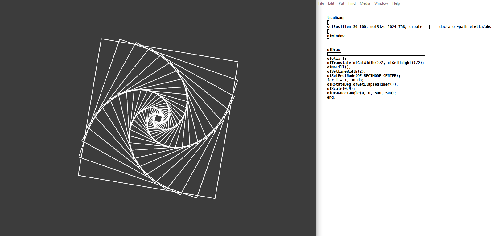

# openFrameworks to ofelia tutorial series

Adaptation of the openFrameworks tutorials by [**Lewis Lepton**](http://lewislepton.com) for amasing Pure data external **ofelia** (v4.0.0). 
Found and explain diferences in original openFrameworks and ofelia methods, used in this course. 
Unfortunately addons, used in this tutorials, not available in ofelia for now. And I didn't do videos wich include any addons.
Except `ofxKinnekt`, which was replaced by the standard `ofVideoGrabber` and `ofxAssimpModelLoader`, which was replaced by the standard `ofMesh`. 
Instead of the ofxGui GUI I used the built in pure data GUI objects.
And took pure data sound analizing tools for building sound spectrum in 047 and 048 patches.

---

Watch the original openFrameworks playlist here: [**openFrameworks Tutorial Series**](https://www.youtube.com/watch?v=dwt2NAd1ZYY&list=PL4neAtv21WOlqpDzGqbGM_WN2hc5ZaVv7)

---

## Resources

* original tutorial series [**GitHub repo**](https://github.com/lewlepton/openFrameworksTutorialSeries)
* ofelia [**GitHub repo**](https://github.com/cuinjune/Ofelia)
* ofxLua [**GitHub repo**](https://github.com/danomatika/ofxLua)
* openFrameworks [**Documentation**](https://openframeworks.cc/documentation/)
* Lua 5.3 [**Reference Manual**](https://www.lua.org/manual/5.3/)